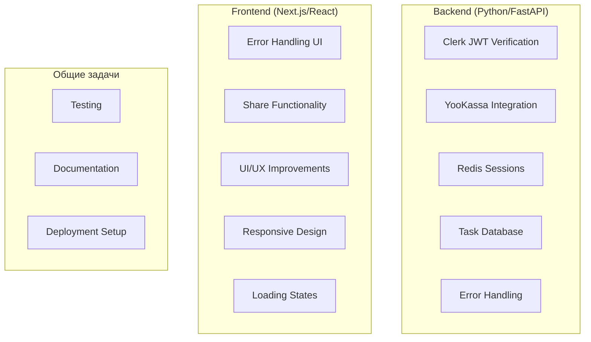

# План доработки AI Mock Interview

## Общая информация

**Проект:** AI Mock Interview Platform

**Команда:** 2 fullstack разработчика

**Цель:** Довести проект до production-ready состояния

## Архитектура доработок

## Разделение задач

### Разработчик 1: Интеграции и Backend инфраструктура

**Приоритет: Высокий**

#### 1. Clerk JWT Verification

- **Файл:** `backend/app/services/auth.py`
- **Задача:** Реализовать полную верификацию JWT токенов через Clerk JWKS
- **Детали:**
  - Заменить упрощённую верификацию (строки 28-49)
  - Использовать библиотеку `pyjwt` с JWKS endpoint
  - Добавить кеширование JWKS ключей
  - Обработать ошибки верификации
- **Оценка:** 4-6 часов

#### 2. YooKassa Payment Integration

- **Файлы:** 
  - `backend/app/services/payment.py` (строки 58-100)
  - `backend/app/routers/payment.py` (строка 54)
- **Задача:** Полная интеграция с YooKassa API
- **Детали:**
  - Инициализировать YooKassa SDK (`_init_yookassa`)
  - Реализовать создание платежей через YooKassa API
  - Добавить верификацию webhook подписи
  - Обработать все статусы платежей (succeeded, canceled, pending)
  - Убрать mock-платежи из production кода
- **Оценка:** 6-8 часов

#### 3. Redis Session Storage

- **Файл:** `backend/app/services/interview.py` (строка 17)
- **Задача:** Заменить in-memory хранилище сессий на Redis
- **Детали:**
  - Добавить `redis` в `requirements.txt`
  - Создать Redis client wrapper
  - Мигрировать `_sessions` dict на Redis
  - Добавить TTL для сессий (24 часа)
  - Обработать ошибки подключения к Redis
- **Оценка:** 4-6 часов

#### 4. Расширение базы задач

- **Файл:** `backend/scripts/seed_tasks.py`
- **Задача:** Добавить больше вопросов для интервью
- **Детали:**
  - Минимум 30-40 задач (сейчас ~12)
  - Покрыть все комбинации: specialization × level × tier × topic
  - Особое внимание на "random" topic - обеспечить разнообразие
  - Добавить валидацию уникальности задач
- **Оценка:** 6-8 часов

#### 5. Backend Error Handling

- **Файлы:** Все роутеры в `backend/app/routers/`
- **Задача:** Улучшить обработку ошибок согласно PRD (п.2)
- **Детали:**
  - Добавить retry логику для LLM API ошибок
  - Создать кастомные exception классы
  - Добавить логирование ошибок
  - Вернуть понятные сообщения об ошибках
- **Оценка:** 3-4 часа

**Итого для Разработчика 1:** ~23-32 часа

---

### Разработчик 2: Frontend UX и дополнительные фичи

**Приоритет: Высокий**

#### 1. Error Handling UI

- **Файлы:** 
  - `frontend/src/components/InterviewChat.tsx`
  - `frontend/src/components/SelectionFlow.tsx`
  - `frontend/src/components/FinalReport.tsx`
- **Задача:** Реализовать обработку ошибок с кнопкой "Попробовать снова" (PRD п.2)
- **Детали:**
  - Добавить ErrorBoundary компоненты
  - Показывать retry кнопки при ошибках API
  - Обработать ошибки на: выдаче задания, фидбека, финальных рекомендаций, оплаты
  - Показывать понятные сообщения пользователю
- **Оценка:** 4-6 часов

#### 2. Share Functionality

- **Файл:** `frontend/src/components/FinalReport.tsx` (строка 236)
- **Задача:** Реализовать функционал "Поделиться результатами"
- **Детали:**
  - Использовать Web Share API
  - Fallback на копирование ссылки в clipboard
  - Создать shareable URL с результатами
  - Добавить социальные кнопки (Telegram, VK, etc.)
- **Оценка:** 3-4 часа

#### 3. UI/UX Improvements

- **Файлы:** Все компоненты в `frontend/src/components/`
- **Задача:** Улучшить пользовательский опыт
- **Детали:**
  - Плавные переходы между экранами (уже есть, но можно улучшить)
  - Skeleton loaders вместо простых спиннеров
  - Toast notifications для успешных действий
  - Улучшить анимацию сферы (более плавные переходы)
  - Добавить звуковые эффекты (опционально)
- **Оценка:** 6-8 часов

#### 4. Responsive Design

- **Файлы:** Все компоненты + `frontend/src/app/globals.css`
- **Задача:** Адаптивность для мобильных устройств
- **Детали:**
  - Протестировать на разных размерах экранов
  - Адаптировать AnimatedSphere для мобильных
  - Улучшить мобильную версию чата
  - Оптимизировать тач-интерфейсы
- **Оценка:** 4-6 часов

#### 5. Loading States & Optimistic UI

- **Файлы:** `frontend/src/components/InterviewChat.tsx`, `SelectionFlow.tsx`
- **Задача:** Улучшить индикацию загрузки
- **Детали:**
  - Показывать прогресс обработки LLM ответа
  - Оптимистичные обновления UI
  - Skeleton screens для контента
- **Оценка:** 2-3 часа

#### 6. Admin Panel (опционально)

- **Новый модуль:** `frontend/src/app/admin/`
- **Задача:** Создать админ-панель для управления задачами
- **Детали:**
  - CRUD для задач
  - Просмотр статистики интервью
  - Управление пользователями
  - Просмотр LLM ответов для валидации
- **Оценка:** 8-12 часов (если делать)

**Итого для Разработчика 2:** ~19-27 часов (без админки) или ~27-39 часов (с админкой)

---

## Общие задачи (оба разработчика)

### 1. Testing

- **Backend:** Unit тесты для сервисов, интеграционные тесты для API
- **Frontend:** Component тесты (React Testing Library), E2E тесты (Playwright)
- **Оценка:** 8-12 часов (по 4-6 часов каждому)

### 2. Documentation

- Обновить README с инструкциями по деплою
- Добавить API документацию (уже есть через FastAPI docs)
- Создать CONTRIBUTING.md
- **Оценка:** 2-3 часа

### 3. Deployment Setup

- Настроить CI/CD (GitHub Actions)
- Подготовить production конфигурации
- Настроить мониторинг и логирование
- **Оценка:** 4-6 часов

---

## Приоритизация

### Фаза 1: Критичные фичи (1-2 недели)

1. ✅ Clerk JWT Verification (Разработчик 1)
2. ✅ YooKassa Integration (Разработчик 1)
3. ✅ Error Handling UI (Разработчик 2)
4. ✅ Redis Sessions (Разработчик 1)

### Фаза 2: Важные улучшения (2-3 недели)

5. ✅ Расширение базы задач (Разработчик 1)
6. ✅ UI/UX Improvements (Разработчик 2)
7. ✅ Responsive Design (Разработчик 2)
8. ✅ Backend Error Handling (Разработчик 1)

### Фаза 3: Дополнительные фичи (3-4 недели)

9. ✅ Share Functionality (Разработчик 2)
10. ✅ Loading States (Разработчик 2)
11. ✅ Testing (оба)
12. ✅ Admin Panel (Разработчик 2, опционально)

---

## Рекомендации по работе

1. **Коммуникация:** Используйте GitHub Issues для трекинга задач
2. **Ветки:** Создавайте feature branches от `main`
3. **Code Review:** Обязательный review перед merge
4. **Еженедельные синки:** Обсуждайте прогресс и блокеры
5. **Документация:** Обновляйте план по мере необходимости

## Зависимости между задачами

- **YooKassa** можно делать параллельно с **Error Handling UI**
- **Redis Sessions** нужно сделать до масштабирования
- **Расширение задач** можно делать параллельно с **UI improvements**
- **Testing** лучше делать после завершения основных фич

## Метрики успеха

- ✅ Все интеграции работают в production
- ✅ Нет критичных багов
- ✅ UI адаптивен для мобильных
- ✅ Обработка ошибок работает корректно
- ✅ База содержит минимум 30 задач
- ✅ Проект готов к деплою
